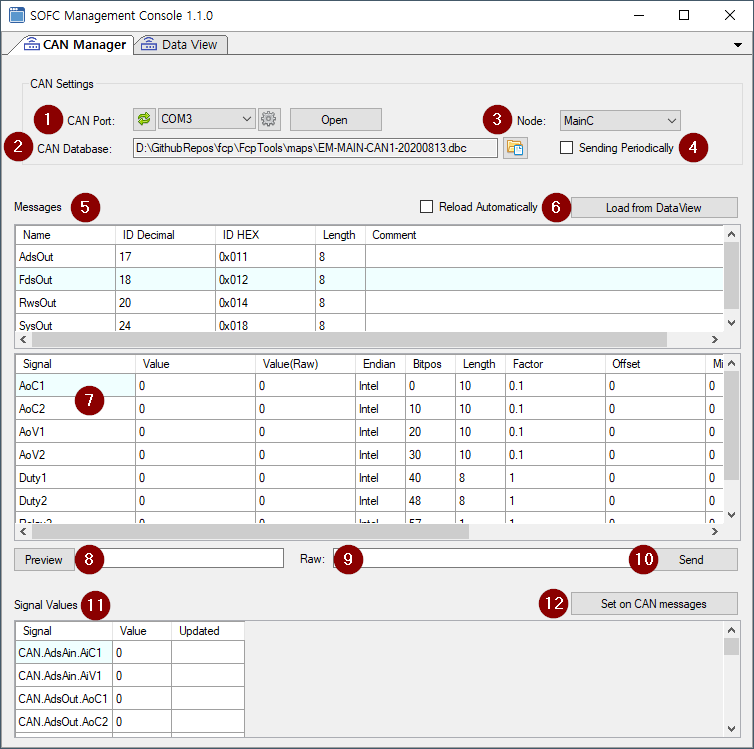

## CAN Manager

CAN Message를 작성해 보내거나 수신한  Message의 내용을 보여준다.

### 화면 구성

### CAN 버스 설정

CAN 메시지를 송수신하기 위한 CAN Converter용 포트를 설정하고 통신에 사용할 CAN 데이터베이스 파일(.dbc)을 지정한다. DBC로부터 Node 목록을 읽어오면 CAN Manager가 어느 Node의 역할을 할 것인지 선택한다.

1. CAN 포트 설정
   - Port 목록: PC에 구성된  Serial Port 목록을 읽어 온다. `Refresh` 버튼을 클릭해서 다시 읽어 올 수 있다.
   - Port 선택: USB-CAN 컨버터가 연결된 포트를 선택한다.
   - 통신 설정: 컨버터와 CAN 디바이스간에는 CAN 통신을 하지만 PC와 컨버터 간에는 `Serial Over USB` 통신을 한다. PC에서는 컨버트를 시리얼 디바이스로 인식하므로 Baud Rate, Parity, Data Bit 등을 컨버터의 통신 파라미터와 동일하게 설정한다.
2. CAN DB 파일 선택
   - CAN 메시지 포맷을 정의한 CAN Database 파일을 선택해서 로딩한다.
   - [Not supported]
3. Node 선택
   - CAN Database 파일로부터 CAN Node 목록을 읽어 온다.
   - CAN Manager가 담당할 Node(역할)을 선택한다.
4. 주기적인 전송
   - CAN Node가 생성할 수 있는 메시지 목록이 `(5)`항에 표시된다. 이 메시지에 설정된 값으로 주기적으로 메시지를 생성해 전송할 수 있다.
   - [Not supported]

### CAN 메시지

CAN 데이터베이스 파일에 정의된 메시지 중에서 CAN Manager가 담당하는 메시지 목록을 읽어 온다. `(3)`에서 선택한 Node에 의해 결정된다.

### CAN 시그널

`(5)`에서 선택한 메시지의 데이터 필드를 구성하는 Signal 목록과 Signal의 상세 정보를 보여준다. `Value` 컬럼의 셀을 선택하거나 더블클릭해서 각 Signal의 값을 설정할 수 있다. 여기서 변경한 Signal 값은 CAN Message를 생성할 때 사용된다.

### 메시지 미리보기

CAN 메시지를 전송하기 전에 데이터 필드의 내용을 Hexadecimal 포맷으로 미리 볼 수 있다.

PC와 Converter 구간에서 CAN 메시지가 시리얼 통신으로 어떻게 전송되는지 Raw Data를 미리보기 할 수 있다. 이 Raw Data는 사용하는 CAN Converter마다 다르다. CAN Manager는 시스템베이스의 `uCAN3 컨버터`용으로 메시지를 변환한다.

### Signal 전체 보기

Signal은 메시지에 속해 있고 중복 가능한 이름을 가지므로 Signal 이름만 가지고 어느 메시지에 할당되어 있는지 찾기 어렵다. 메시지와 Signal 이름을 합쳐서 고유 식별자를 만든 후 모든 시그널을 한 화면에서 제공한다.

- 이 화면에서 Signal의 값을 변경한 후 `(12) [Set on CAN Messages]` 버튼을 클릭해서 각 CAN Message의 Data Field에 Signal 값을 적용할 수 있다.

### Data View 연계

`Management Tool`은 CAN Manager 외에 다양한 기능을 제공한다. `Data View`는 `Management Tool`이 관리하는 모든 데이터를 보여준다. 이 데이터의 식별자를 `Tag`라고 하는데 `Data View`의 일부 Tag는 CAN Message의 Signal에 매핑되어 있다.

- `(6) [Load from Data View]` 버튼을 클릭하면 Data View에 매핑된 Signal의 값을 읽어서 CAN Message의 Data Field에 업데이트한다.
- `Reload Automatically` 를 체크하면 주기적으로 Data View의 값을 CAN Message에 로딩한다.
- `Reload Automatically`와 `Sending Periodically`가 체크되어 있는 상태에서 `Test Manager`나 `Constrol Strategy Model`에 의해 Data VIew의 Tag 값이 동적으로 변화하면 `Main 제어기`를 대신해서 `Device`를 시나리오 기반으로 연속 제어할 수 있다. 
